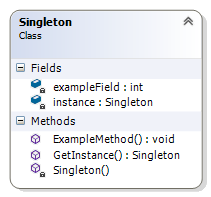

##Singleton Pattern##

Singleton Pattern „u object **creational** „Š„p„q„|„€„~. „S„€„z „u creational, „x„p„‹„€„„„€ „y„}„p „€„„„~„€„Š„u„~„y„u „{„Œ„} „ƒ„Œ„x„t„p„r„p„~„u„„„€ „~„p „€„q„u„{„„„y. „P„€-„ƒ„�„u„ˆ„y„p„|„~„€, „„„€„z „ˆ„u„|„y „t„p „€„s„‚„p„~„y„‰„y „ƒ„Œ„x„t„p„r„p„~„u„„„€ „~„p „�„€„r„u„‰„u „€„„ „u„t„y„~ „€„q„u„{„„ „€„„ „{„€„~„{„‚„u„„„u„~ „{„|„p„ƒ. Singleton Pattern „u **object** „Š„p„q„|„€„~, „x„p„‹„€„„„€ „u „p„~„s„p„w„y„‚„p„~ „ƒ „r„‚„Œ„x„{„y„„„u „}„u„w„t„… „€„q„u„{„„„y„„„u („„.„u. „…„~„y„{„p„|„~„p„„„p „y„~„ƒ„„„p„~„ˆ„y„‘ „{„Œ„} „€„q„u„{„„, „{„€„‘„„„€ „t„p„t„u„~ „{„|„p„ƒ „t„Œ„‚„w„y „y „t„€„ƒ„„„Œ„�„p „~„p „t„‚„…„s„y „€„q„u„{„„„y „t„€ „~„u„s„€).

**„N„u„€„q„‡„€„t„y„}„€„ƒ„„„„„p** „€„„ „�„‚„y„|„p„s„p„~„u „~„p Singleton Pattern „r„Œ„x„~„y„{„r„p „�„‚„y „}„€„t„u„|„y„‚„p„~„u „~„p „€„q„u„{„„„y, „{„€„y„„„€ „y„}„p„„ „ƒ„p„}„€ „u„t„~„p „y„~„ƒ„„„p„~„ˆ„y„‘ „r „‚„u„p„|„~„y„‘ „ƒ„r„‘„„. „S„p„{„p „~„p„�„‚„y„}„u„‚, „r „{„|„p„ƒ *Computer* „}„€„w„u „t„p „y„}„p „ƒ„p„}„€ „u„t„~„€ „…„ƒ„„„‚„€„z„ƒ„„„r„€ „x„p „r„Œ„x„�„‚„€„y„x„r„€„u„w„t„p„~„u „~„p „x„r„…„{. „B „ƒ„|„…„‰„p„z, „‰„u „ƒ„u „t„€„�„…„ƒ„~„u „ƒ„Œ„x„t„p„r„p„~„u„„„€ „~„p „~„‘„{„€„|„{„€ „„„p„{„y„r„p „…„ƒ„„„‚„€„z„ƒ„„„r„p „y „u„t„~„€„r„‚„u„}„u„~„~„€„„„€ „y„x„r„u„w„t„p„~„u „~„p „‚„p„x„|„y„‰„u„~ „x„r„…„{, „{„‚„p„z„~„y„‘„„ „‚„u„x„…„|„„„p„„ „‹„u „ƒ„u „‚„p„x„|„y„‰„p„r„p „€„„ „€„‰„p„{„r„p„~„y„‘.

**„W„u„|„y„„„u**, „{„€„y„„„€ „ƒ„u „�„‚„u„ƒ„|„u„t„r„p„„ „�„‚„y „�„‚„y„|„p„s„p„~„u„„„€ „~„p Singleton Pattern „ƒ„p „t„r„u:

+ „�„€„t„ƒ„y„s„…„‚„‘„r„p„~„u „ƒ„Œ„x„t„p„r„p„~„u„„„€ „~„p „ƒ„p„}„€ „u„t„~„p „y„~„ƒ„„„p„~„ˆ„y„‘ „~„p „t„p„t„u„~ „{„|„p„ƒ;
+ „€„ƒ„y„s„…„‚„‘„r„p„~„u „~„p „t„€„ƒ„„„Œ„� „t„€ „„„p„x„y „y„~„ƒ„„„p„~„ˆ„y„‘.
 
Singleton Pattern „u **„�„‚„y„|„€„w„y„}** „�„‚„y „~„p„|„y„‰„y„u „~„p „{„€„~„{„…„‚„u„~„„„~„y „x„p„‘„r„{„y „x„p „t„€„ƒ„„„Œ„� „t„€ („€„q„‹„y) „‚„u„ƒ„…„‚„ƒ„y, „{„€„u„„„€ „r„€„t„y „t„€ „~„u„€„q„‡„€„t„y„}„€„ƒ„„ „€„„ „ˆ„u„~„„„‚„p„|„y„x„y„‚„p„~„€ „€„ƒ„y„s„…„‚„‘„r„p„~„u „~„p „t„€„ƒ„„„Œ„�„p „t„€ „„„‘„‡.

„B „ƒ„€„†„„„…„u„‚„~„y„‘ „t„y„x„p„z„~, **„…„�„€„„„‚„u„q„p„„„p** „~„p Singleton Pattern „ƒ„u „u „~„p„|„€„w„y„|„p „r „ƒ„|„u„t„~„y„„„u „ƒ„|„…„‰„p„y:

+  „�„‚„y „t„y„x„p„z„~ „~„p *Logger* „{„|„p„ƒ„€„r„u;
+  „�„‚„y „t„y„x„p„z„~ „~„p *Configuration* „{„|„p„ƒ„€„r„u;
+  „�„‚„y „t„€„ƒ„„„Œ„� „t„€ „ƒ„�„€„t„u„|„u„~„y „‚„u„ƒ„…„‚„ƒ„y („~„p„�„‚. „ƒ„u„‚„y„u„~ „�„€„‚„„);
+  „r „{„€„}„q„y„~„p„ˆ„y„‘ „ƒ Abstract Factory „y„|„y Factory Method „Š„p„q„|„€„~„y„„„u, „�„‚„y „„„‘„‡„~„€„„„€ „y„x„�„€„|„x„r„p„~„u „r „}„~„€„s„€„~„y„Š„{„€„r„p „ƒ„‚„u„t„p.

Singleton Pattern „ƒ„u **„y„}„�„|„u„}„u„~„„„y„‚„p** „‰„‚„u„x *static „�„€„|„u* „r Singleton „{„|„p„ƒ„p,  *private „{„€„~„ƒ„„„‚„…„{„„„€„‚* „y *static public „}„u„„„€„t*, „{„€„z„„„€ „r„‚„Œ„‹„p „‚„u„†„u„‚„u„~„ˆ„y„‘ „{„Œ„} static „�„€„|„u„„„€.

	using System.Runtime.CompilerServices;

    internal class Singleton
    {
        private static Singleton instance;

        private int exampleField;

        private Singleton()
        {
        }

        [MethodImpl(MethodImplOptions.Synchronized)]
        public static Singleton GetInstance()
        {
            if (instance == null)
            {
                return new Singleton();
            }
            else
            {
                return instance;
            }
        }

        public void ExampleMethod()
        {
        }
    }

„P„‚„y „y„}„�„|„u„}„u„~„„„p„ˆ„y„‘„„„p „~„p Singleton Pattern **„…„‰„p„ƒ„„„r„p„„** Singleton „{„|„p„ƒ„p „y „{„|„y„u„~„„„p.

+ *Singleton „{„|„p„ƒ„p* „t„u„†„y„~„y„‚„p „}„u„„„€„t, „{„€„z„„„€ „t„p„r„p „r„Œ„x„}„€„w„~„€„ƒ„„ „x„p „t„€„ƒ„„„Œ„� „t„€ „~„u„s„€„r„p„„„p „…„~„y„{„p„|„~„p „y„~„ƒ„„„p„~„ˆ„y„‘. „I„~„ƒ„„„p„~„ˆ„y„‚„p„~„u„„„€ „ƒ„u „‚„u„p„|„y„x„y„‚„p „{„p„„„€ static „}„u„„„€„t, „{„€„‘„„„€ „€„„„s„€„r„p„‚„‘ „x„p „ƒ„Œ„x„t„p„r„p„~„u„„„€ „~„p „u„t„y„~„ƒ„„„r„u„~„p „y„~„ƒ„„„p„~„ˆ„y„‘ „~„p „{„|„p„ƒ„p.
+ *„K„|„y„u„~„„„Œ„„* „�„€„|„…„‰„p„r„p „t„€„ƒ„„„Œ„� „t„€ Singleton „{„|„p„ƒ„p, „u„t„y„~„ƒ„„„r„u„~„€ „‰„‚„u„x „~„u„s„€„r„y„‘ static „}„u„„„€„t.

**„R„|„u„t„ƒ„„„r„y„‘„„„p** „€„„ „y„x„�„€„|„x„r„p„~„u„„„€ „~„p Singleton Pattern „ƒ„p:

+ „€„ƒ„y„s„…„‚„‘„r„p„~„u „~„p „{„€„~„„„‚„€„|„y„‚„p„~ „t„€„ƒ„„„Œ„� „~„p „{„|„y„u„~„„„y„„„u „t„€ „u„t„y„~„ƒ„„„r„u„~„p„„„p „y„~„ƒ„„„p„~„ˆ„y„‘ „~„p Singleton „{„|„p„ƒ„p;
+ „‚„p„x„Š„y„‚„‘„r„p„~„u „†„…„~„{„ˆ„y„€„~„p„|„~„€„ƒ„„„„„p „r „ƒ„‚„p„r„~„u„~„y„u „ƒ „s„|„€„q„p„|„~„y„„„u „�„‚„€„}„u„~„|„y„r„y;
+ „r„Œ„x„}„€„w„~„€„ƒ„„ „x„p „~„p„ƒ„|„u„t„‘„r„p„~„u „y „‚„p„x„Š„y„‚„‘„r„p„~„u „†„…„~„{„ˆ„y„€„~„p„|„~„€„ƒ„„„„„p „~„p Singleton „{„|„p„ƒ„p;
+ „s„Œ„r„{„p„r„€„ƒ„„ „r „ƒ„‚„p„r„~„u„~„y„u „ƒ „€„�„‚„u„t„p„ˆ„y„y„„„u „r„Œ„‚„‡„… „{„|„p„ƒ„€„r„u;

„R„„„‚„…„{„„„…„‚„p:

